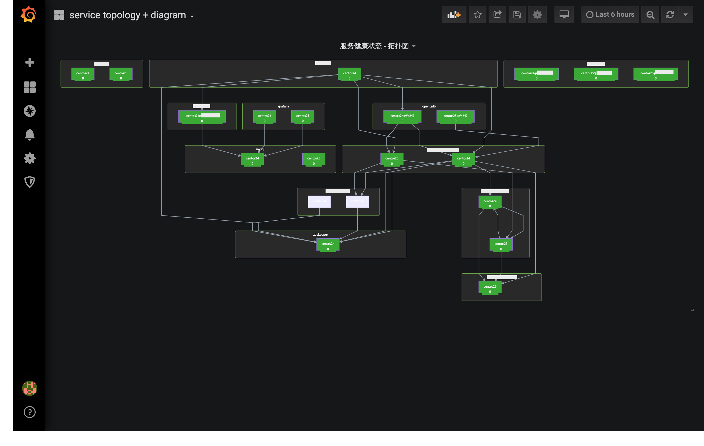

### 使用 grafana 拓扑图监控服务的健康状态

*注：基于 grafana 平台，使用 diagram-panel & opentsdb-datasource*

> 一个服务的健康状态，是通过某些关键指标（kpi指标）的值综合反映的结果。

##### 为什么要使用拓扑图的形式进行监控？
使用单纯的图表(线/柱/饼)监控的缺点：
1. 曲线多    
假设监控服务A有 10 个kpi指标，服务A部署在 10 个节点上。那么就会有 100 条曲线，眼花缭乱。
2. 人力成本高    
需要有经验并熟悉的该服务A的运维人员，综合思考后得出结果结果。
3. 服务上下游无法体现    
无法及时反映出调用服务A，以及被服务A调用的服务，是否被影响。

##### 如何实现
grafana-diagram-panel + datasource

1. 构建系统的服务拓扑图    
在这里，我们的服务拓扑图是通过自动发现挖掘出来的一个 json 文件，然后转换为 mermaid 需要的格式。

json:
```
{
  "nodes": [
    {
      "id": "xx",
      "name": "oo",
      "parent": "nodeId",
      ...
    },
  ],
  "edges": [
    {
      "source": "nodeId",
      "target": "nodeId",
      "data": {...}
    },
  ]
}
```
mermaid:
```
graph TB
subgraph serviceKey1[serviceName1]
serviceInstanceKey1-1[serviceInstanceName1-1]
serviceInstanceKey1-2[serviceInstanceName1-2]
end
subgraph serviceKey2[serviceName2]
serviceInstanceKey2-1[serviceInstanceName2-1]
serviceInstanceKey2-2[serviceInstanceName2-2]
end
serviceInstanceKey1-1 --> serviceInstanceKey2-1
```

2. 配置指标数据    
安装 `grafana-diagram-panel`，数据源使用了我这里现成的 `opentsdb`。下面的例子，我将用 <serviceName>.alive 来表示服务的健康状态。
查询参数设置很简单，就是指标名、过滤条件、tag、别名、采样频率、聚合方式等等。
让拓扑图的节点正确显示出颜色的重点是：**使上述格式中的节点id（serviceKey）和图上的图例名（legend label）一致**。

比如，查询条件为：
```
metric: mysql.alive
tags: host=*
```
图例格式化后为：
mysql.alive{host=A}
mysql.alive{host=N}
那么，上面 diagram 对应就应变为：
```
mysql.alive{host=A}[mysqlA]
```

走到这里，你会发现上面写的 diagram 会报错。这是因为 mermaid 不支持一些特殊符号。所以需要在 display 一栏中，设置一些 replace 规则。比如：
```
/\./g => _
{     => _
}     => _
=     => _
```
这样，图例就会变为：
mysql_alive_host_A_
mysql_alive_host_N_
那么，diagram 对应就应变为：
mysql_alive_host_A_[mysqlA]

好了，现在就能出现一个标着 mysqlA 的矩形了。

##### 最终效果


### 优化点
体验一番之后，会发现有两个不舒服的地方：
一是 服务的健康状态不可能是由一个指标决定的，它可能是 N 个指标加减乘除等运算后的结果。目前 grafana 的 opentsdb 插件是不支持多指标运算的。如果你使用的是 Promethus / Graphite 之类的就没有问题。
二是 标准 diagram 格式的拓扑图自动化生成。
虽然我们的脚本是把某个系统的服务拓扑关系挖出来了，但是为了结合指标数据，你需要用图例名做key。这个格式标准化应该是可以通过配置规则或者补一点代码来使之自动化的。

最后，这个diagram UI确实是不美观，但就日常监控来说，其实用性远大于美观性。
